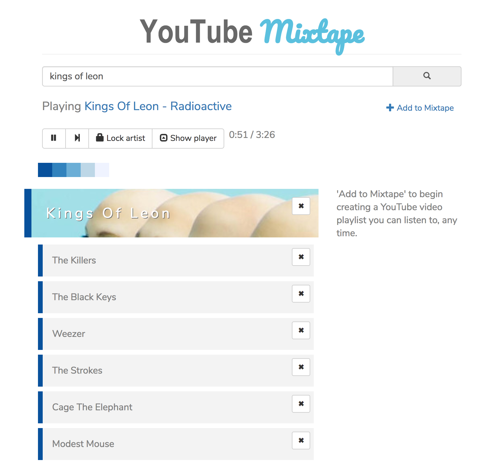

# YouTube Mixtape

Search for an artist and the app will utilize Spotify to find similar artists based on common genres. These results appear immediately in the main column. Clicking on an artist result will trigger a YouTube search and begin playing a resulting video.

The app also gives you the ability to create and edit a YouTube playlist. Note that to save your playlist, you will be required to sign into your Google account. Get started with this feature by clicking 'Add to Mixtape.'

**tl;dr** It's a music radio app!

## View the app
Deployed [here](https://gentle-mountain-68973.herokuapp.com/) on Heroku for demonstration purposes.



### On Mobile
Although it's not yet optimized for mobile use, the responsive design allows usable functionality.


## To install locally
1. Clone this repo    
2. ````cd YouTube-Mixtape````             
3. ````npm i```` to install dependencies    
4. ````npm run start```` to get things going on localhost:3000